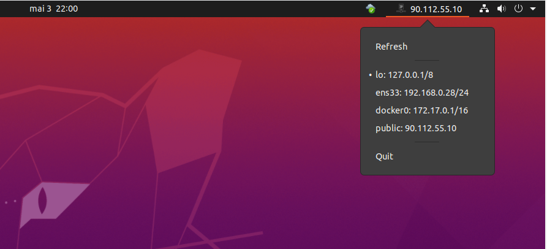

# Indicator IP

Ubuntu indicator that displays local and external IP addresses in your task bar.



## Installation

Ubuntu 18.04:
```
sudo add-apt-repository ppa:nico-marcq/indicator-ip
sudo apt-get update
sudo apt-get install python3-indicator-ip
```

Then run
```
indicator-ip
```

## Dev environment installation

Install system packages
```
sudo apt-get install gcc python3-dev python3-gi python3-gi-cairo libcairo2-dev  \
libjpeg-dev libgif-dev gir1.2-gtk-3.0 gobject-introspection libgirepository1.0-dev pkg-config
```

Install python package
```
sudo pip install -r requirement.txt
```

You can then execute the entry point
```
python3 indicator-ip.py
```


## Push to PPA

Build
```
python setup.py --command-packages=stdeb.command bdist_deb
```

Launchpad reject a build that contains both source and binary. We need to generate only the source package
```
mkdir tmp
cd tmp
dpkg-source -x ../deb_dist/indicator-ip_1.0-1.dsc
```

Update the version
```
sed -i 's/unstable/bionic/g' debian/changelog
```

Build and sign the source package
```
debuild -S -sa
```

Push to ppa
```
dput -f ppa:nico-marcq/indicator-ip tmp/indicator-ip_1.0-1_source.changes
```

The GPG key that signed the package need to be available on Ubuntu key servers
```
gpg --keyserver keyserver.ubuntu.com --send-key <key id>
```
